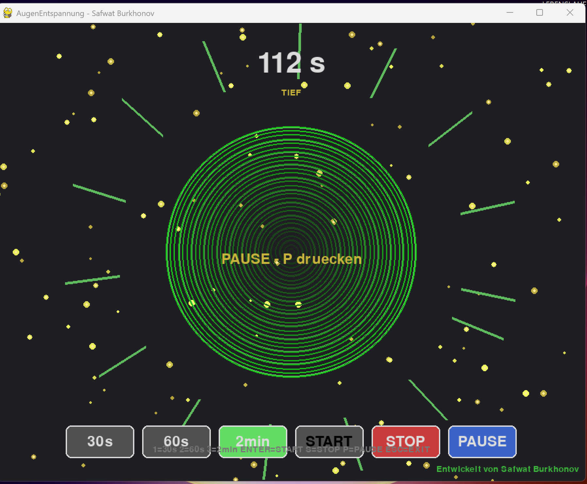

# 👁️ AugenEntspannung

**Programm zur Entspannung der Augen bei langer Bildschirmarbeit**

---

## 📖 Beschreibung

**AugenEntspannung** ist ein kostenloses Programm, das hilft, müde Augen in **30–120 Sekunden** zu entspannen.

Sie müssen nichts tun – einfach **auf den Bildschirm schauen**. Keine Übungen, keine Handbewegungen. Die gesamte Behandlung erfolgt durch **Licht, Farbe, Bewegung und Rhythmen**.

---

## 📸 Screenshot



---

## 🧠 Wissenschaftliche Grundlage

Das Programm basiert auf Daten aus Peer-Review-Studien (2012–2025):

| Methode | Quelle | Effekt |
|---------|--------|--------|
| **Gelb-grünes Spektrum (520–590 nm)** | Ibrahimi et al. (2023) | Verbesserung der Kontrastempfindlichkeit, Reduzierung der VEP-Latenz um 3.6 ms |
| **Periphere Stimulation (7 Hz)** | Venkataraman (2016) | Stimulation des magnozellulären Pfades, Entspannung der Akkommodation |
| **Optischer Fluss (sich ausdehnender Tunnel)** | Looming-Forschung | Reflexartige Umschaltung der Augen in den „Fernmodus“ |
| **Ophthalmochromotherapie** | Studien mit 132 Patienten | Verbesserung der Akkommodation bei Belastung (p < 0.01) |

**Das Programm behandelt NICHT Kurzsichtigkeit, Weitsichtigkeit, Astigmatismus, Katarakt oder Glaukom.** Es wirkt nur bei **funktionellem Akkommodationsspasmus** (Augenermüdung).

---

## ⚙️ Betriebsmodi

| Modus | Dauer | Wann verwenden |
|-------|-------|----------------|
| **Schnell** | 30 Sekunden | Leichte Augenbelastung |
| **Standard** | 60 Sekunden | Normale Ermüdung nach 2–3 Stunden Arbeit |
| **Tiefenentspannung** | 2 Minuten | Starke Überanstrengung, Brennen, Fokussierungsprobleme |

---

## 🎮 Bedienung

### Tastatur

| Taste | Aktion |
|-------|--------|
| `1` | Modus 30 s wählen |
| `2` | Modus 60 s wählen |
| `3` | Modus 2 min wählen |
| `ENTER` oder `LEERTASTE` | Start |
| `S` oder `0` | Stopp |
| `P` | Pause / Fortsetzen |
| `ESC` | Beenden |

### Bildschirmtasten

- **30s / 60s / 2min** — Modus wählen
- **START** — Starten
- **STOP** — Stoppen
- **PAUSE** — Pause

---

## ⚠️ Kontraindikationen

**Absolute (NICHT verwenden):**

- Epilepsie (lichtempfindliche Form)
- Glaukom (Grüner Star)
- Netzhautablösung (in der Vorgeschichte)
- Akute Augenentzündungen (Konjunktivitis, Uveitis, Keratitis)
- Schwere Hypertonie

**Relative (Arztkonsultation erforderlich):**

- Diabetische Retinopathie
- Makuladegeneration
- Katarakt (späte Stadien)
- Schwangerschaft

> ⚠️ Bei Schmerzen, Schwindel oder Sehverschlechterung → **STOP** drücken und Augenarzt aufsuchen.

---

## 📥 Installation und Start

### Variante 1: Fertige .exe (empfohlen)

1. Laden Sie `AugenEntspannung.exe` aus dem Bereich [Releases](https://github.com/SafwatTj/AugenEntspannung/releases) herunter
2. Starten Sie die Datei
3. Lesen Sie die Warnung und drücken Sie eine beliebige Taste

### Variante 2: Aus dem Quellcode

```bash
git clone https://github.com/SafwatTj/AugenEntspannung.git
cd AugenEntspannung
pip install pygame
python AugenEntspannung.py